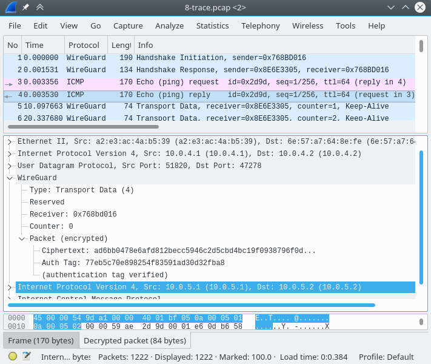

# Wireshark dissector for the WireGuard tunnel protocol
Wireshark dissector (written in Lua) for dissecting the [WireGuard][1] tunneling
protocol.

Requirements:

 - Wireshark 2.0.2 or newer (tested with Wireshark 2.3.x).
 - [luagcrypt][2] and Libgcrypt 1.7 for (optional) decryption support.

The plan is to eventually rewrite this prototype into a dissector that is
included with the main Wireshark sources.

## Installation
Locate the Wireshark configuration directory (either `~/.wireshark` or
`~/.config/wireshark`). Create the `plugins` subdirectory and add `wg.lua` (from
this project).

For decryption support, you must also install [luagcrypt][2]. Once you have
built that native library, install the resulting `luagcrypt.so` to
`/usr/lib/lua/5.2/luagcrypt.so`. Alternatively, set the environment variable
`LUA_CPATH=/path/to/luagcrypt/?.so` (including the `/?.so` suffix). You will
also need to obtain a keylog file (see the next sections) and configure it at
the WG protocol preferences.

To check whether it is installed correctly, run `tshark -G protocols | grep wg`.
You can also try the example packet capture
[pcaps/8-trace.pcap](pcaps/8-trace.pcap) and its corresponding keylog file
[pcaps/8-trace.keys](pcaps/8-trace.keys) for testing.

Since WireGuard does not have a default port number, it is recommended to enable
the UDP protocol preference *Try heuristic sub-dissectors first* (via the menu
Edit → Preferences, Protocols → UDP).

## Obtaining handshake and traffic secrets through key-probe.sh and key-extract.py
The [key-probe.sh](key-probe.sh) script enables tracing WireGuard function calls
using [*kprobes*][3]. This raw data must be post-processed with
[key-extract.py](key-extract.py) to produce a keylog file with handshake and
traffic secrets. A kernel with `CONFIG_KPROBE_EVENT=y` is required (most distros
satisfy this requirement).

To get started, enable the required tracepoints:

    sudo ./key-probe.sh

Next, obtain the trace output and extract keys from it. A one-shot approach that
can be executed periodically:

    sudo cat /sys/kernel/debug/tracing/trace > trace.txt
    ./key-extract.py < trace.txt > trace.keys

To continuously update the keylog file (useful for live captures, but note that
this will erase traces that are read from the file):

    sudo cat /sys/kernel/debug/tracing/trace_pipe | ./key-extract.py > trace.keys

To stop logging more keys, disable the tracepoints with:

    sudo ./key-noprobe.sh

## Obtaining traffic secrets through extract-keys
The `extract-keys` utility included with WireGuard can extract traffic secrets
(for active sessions only) and requires the `CONFIG_DEVKMEM=y` option (many
distros such as Arch Linux Linux, Debian and Ubuntu have it disabled).
See `contrib/examples/extract-keys` in the WireGuard sources for more details.

## License
Copyright (C) 2017 Peter Wu (peter@lekensteyn.nl)

This project is licensed under the GPLv2 (or any later version) license.
See [LICENSE.txt](LICENSE.txt) for more details.

 [1]: https://www.wireguard.io/
 [2]: https://github.com/Lekensteyn/luagcrypt
 [3]: https://www.kernel.org/doc/Documentation/trace/kprobetrace.txt
